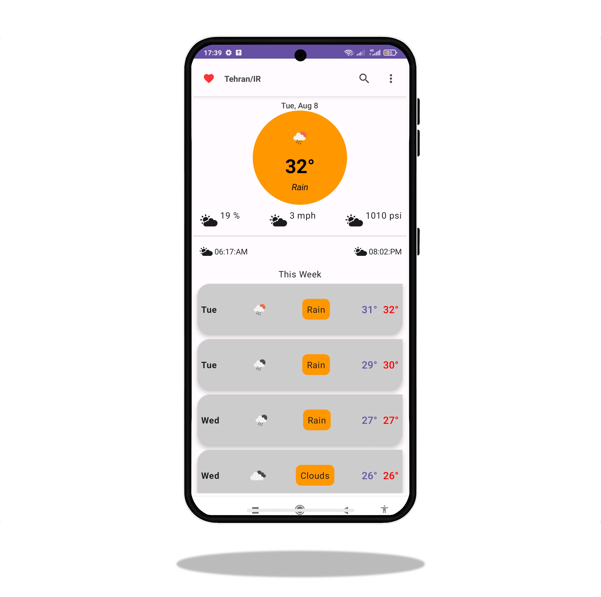
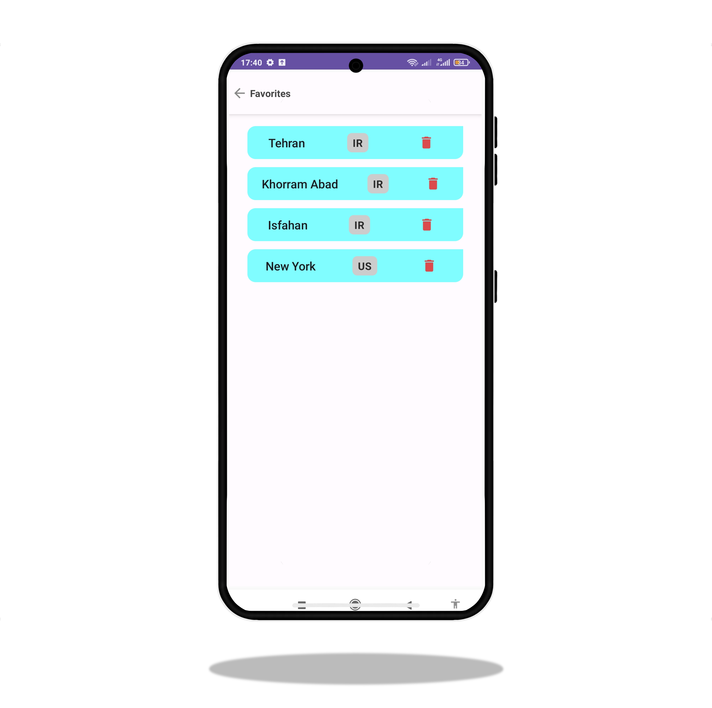

# Jet Weather
___
 

 
 

 

The JetWeather App is a convenient and informative Android application that provides you with up-to-date weather
forecasts for cities around the world. Using data from a reliable weather API and leveraging Room Database for managing
favorites, this app ensures you stay prepared for any weather conditions. This README offers a comprehensive guide on
how to set up and utilize the app effectively. Features

* Real-Time Weather Information: Access accurate and current weather data for cities across the globe. The app fetches
  data from a reliable weather API, offering details such as temperature, humidity, wind speed, and more.

* Favorites Management with Room Database: Keep track of your preferred cities by adding them to your favorites list.
  The app employs Room Database for seamless storage and retrieval of your favorite cities.

* Intuitive User Interface: The app is designed with user-friendliness in mind. The interface is easy to navigate,
  ensuring a smooth and hassle-free experience.

* Automatic Data Updates: Weather data is refreshed at regular intervals, ensuring that you always have access to the
  latest weather conditions.

### Prerequisites

Before using the JetWeather App, ensure you have the following:

* Android Studio installed on your machine.
* A compatible Android device or emulator.

### Installation

* Clone the repository to your local machine:

* `git clone <repository_url>`

* Open Android Studio and choose "Open an Existing Project."

* Navigate to the directory where you cloned the project and select it.

### Usage

* Build and run the app using the Android Studio emulator or a connected Android device.
* Upon launching, the app will greet you with a user-friendly interface.
* To view the weather for a specific city, use the search bar to enter the city name and tap "Search." The app will
  fetch and display the weather data for that city.
* To add a city to your favorites, navigate to the weather forecast page for the desired city. Tap the heart-shaped "Add
  to Favorites" icon. The city will now be part of your favorites list.
* Access your favorites list by selecting the "Favorites" tab. Here, you'll find a comprehensive list of your favorite
  cities and their weather forecasts.
* To remove a city from your favorites, visit the weather forecast page for that city and tap the "Remove from
  Favorites" option.

### Contributing

Contributions to the JetWeather App are welcome and appreciated. If you encounter any issues, wish to propose
enhancements, or would like to add new features, please don't hesitate to open an issue or submit a pull request. Your
involvement will contribute to improving the app and enhancing the user experience.

Thank you for choosing the JetWeather App! Stay weather-informed with ease and convenience, and never be caught off
guard by unexpected weather changes. Enjoy using the app and make the most out of its features!
